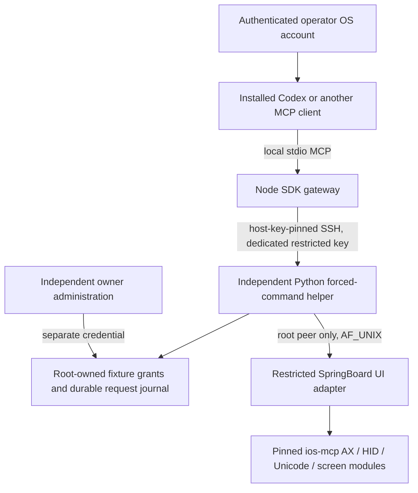

# Architecture decision (2026-09-19)

Select **ios-mcp UI modules**, pinned in `upstreams.json`, as the single iOS UI
executor. Build a separate `device-bridge/` integration because upstream servers
expose more authority than the intended grant. Do not run any upstream listener
alongside this build. No wholesale merge and no second HID hook.

The SSH service and helper do not live in SpringBoard. Status, cancellation and
owner revocation require no UI response. Python 3 with sqlite3 on the actual
jailbreak is a prerequisite, not an assumed capability. The UI adapter uses
private APIs and must be compiled and tested against the actual device. Its
source existing is not a compatibility claim.

## Repository evidence

All three working trees were clean at inspection and remain unchanged. Paths
below are relative to `the parent workspace containing the three candidate repositories`.

| Candidate and pin | Language / entry points | Actual mechanisms and concerns |
|---|---|---|
| ios-mcp `38cafd5fbda7a4dcb3821b94cbb3523fc905c0b2` | Objective-C/Logos; `ios-mcp/Tweak.x`, `MCPServer.m`, `Makefile` | SpringBoard starts a custom HTTP/MCP server. `MCPServer.m:startListenerLockedOnPort:` binds `INADDR_ANY`; `handleToolsCall:` includes root shell, files, packages and URLs. No authenticated principal/grant in this dispatch. `lockedScreenGuardResponseForTool:` is a useful upstream guard, insufficient authorization. Server retries/listener reset depend on SpringBoard. |
| jb-p1lot `9bedf513a56786771c83f6e58c0ddc499033aaf4` | Go host, Objective-C/Logos device; `cmd/jb-p1lot/main.go`, `internal/server/mcp.go`, `device/daemon/main.m`, `device/springboard/Tweak.x` | `device/daemon/Service.m` independent root daemon, Network.framework listener 5912, Bonjour, shell execution; `PairingStore.m` TLS 1.3 client-certificate trust rooted in configured CA; rootless paths hardcoded. `internal/transport/transport.go` validates server name with Go TLS. No per-operation owner grants/fencing in device handler. |
| mobile-mcp `63a5974d9bfa5b66d1ee4d1b0945df3ebea18b11` | TypeScript; `src/index.ts`, `src/server.ts`, `src/mobile-device.ts` | Maintained SDK stdio/stateless Streamable HTTP. HTTP token optional and absent means open service (`src/index.ts`). `src/ios.ts` requires go-ios and WDA forwarding; Android/simulator adapters separate. `src/coordinate-mapping.ts` describes scale to the model rather than enforcing calibrated input. Host inherits caller privileges and WDA capabilities. |

### Relevant implementation traces

- `ios-mcp/AccessibilityManager.m:getCompactUIElementsWithMaxElements:` calls
  `MCPAXNodeSource` through context/provider modules. `MCPAXNodeSource.m` compact
  serialization exposes text, aliases, clickable and integer rect/visible_rect.
  It is not a rich AX action/identifier contract. Our opaque refs refer to this
  observed tree; no guessed identifier matching.
- `ios-mcp/MCPServer.m:parseElementMatchArgs:` treats identifier as exact text;
  `executeTapElement:` takes the first/default indexed match. We do not reuse
  either behavior. The helper selects a unique observation reference.
- `ios-mcp/HIDManager.m:performTapSequenceAtPoint:` and `sendTouchAtPoint:` use
  IOHID; native adapter calls the synchronous sequence and releases in `finally`.
  Returning successfully proves dispatch only, not receipt at the intended view.
- `ios-mcp/TextInputManager.m:sendTextUsingUnicodeHID:` chunks at 64 UTF-16 units.
  Public `inputText:` can fallback to ASCII after a failed Unicode path. We call
  one bounded synchronous Unicode chunk; no automatic fallback or submission.
- `ios-mcp/ScreenManager.m:takeScreenshotPayload` re-encodes to points.
  `captureScreenImage` provides the underlying image. Our adapter encodes that
  to PNG and reports dimensions/transform without a hardware accuracy claim.
  Fallback window capture may not represent the display; source discrimination
  is still a fidelity limitation. Raw orientation needs device validation.
- `ios-mcp/ScreenManager.m:deviceInteractionState` can return unknown lock state;
  this integration denies input/observation unless unlocked and screen on.
- `ios-mcp/AccessibilityManager.m` enables AX bootstrap by default. The sole
  local patch disables `MCPEnableAXUIClientBootstrap`; observation must not
  silently toggle accessibility settings. Build script verifies patch anchor.
- `jb-p1lot/device/springboard/Bridge.m:ui_snapshot` always returns empty nodes;
  stream start creates a URL/session description without a stream server.
  `device/daemon/Service.m` port-forward/debug/frida session handlers likewise
  return descriptors without implementing those backends. Do not count these.
- `jb-p1lot/device/springboard/ScreenCapture.m` can synthesize a black screenshot
  after capture failure. `InputInjector.m` has ASCII and clipboard paths.
  `internal/session/session.go` starts runners on `context.Background()`.
- `jb-p1lot/device/springboard/Bridge.m` socket mode 0660 is not itself peer
  authorization. `Service.m` passes payloads to this socket; transport TLS does
  not restrict an authenticated principal's root commands.
- `mobile-mcp/src/ios.ts`, `webdriver-agent.ts`, `iphone-simulator.ts`, `android.ts`
  are useful adapter examples. Their prerequisites do not disappear on an
  unsupported jailbreak. No additional backend is advertised here.

## Why this transport

Use existing OpenSSH for the first host-assisted deployment: maintained crypto,
explicit host-key pin, dedicated key restricted to the helper, no forwarded agent,
no arbitrary remote command. A second random helper credential binds each
request to a device/principal/audience and is independently revocable. Gateway
operator identity is the configured local OS UID on a protected stdio channel;
remote operators must independently authenticate to the gateway host account.
No provider keys are needed on the device.

For gate C, the selected overlay candidate is Tailscale with ordinary OpenSSH
inside it, not an invented iOS Tailscale SSH server. Its official iOS installation
document says iOS 15+; actual compatibility remains unverified. The host has no
Tailscale binary and no tailnet/device enrollment is available yet. No account,
paid resource, relay, firewall or router configuration was created.
[Official iOS installation](https://tailscale.com/docs/install/ios).

A host on the phone's LAN can run Codex/gateway while a remote operator reaches
that host over an owner-configured overlay. The phone must remain reachable from
that host. If the phone itself runs a validated overlay client, host-to-phone SSH
can use its stable overlay address across Wi-Fi/cellular changes. Neither path
has been tested across networks. No standalone phone-originated relay exists.

## SDK and client evidence

Codex CLI `0.155.1`: `codex --version` and `codex mcp add --help` inspected.
`bridge connect codex` rechecks those commands and emits a stdio entry only.
No live Codex config was changed. Official configuration supports `command` and
`args` for stdio; unrelated settings and sandbox/approval protections stay intact.
[Official Codex MCP documentation](https://learn.chatgpt.com/docs/extend/mcp?surface=cli).

SDK `@modelcontextprotocol/sdk@1.30.0` with Zod `4.1.13`, exact lockfile and integrity
hashes. Installed `dist/esm/types.js` lists `2025-11-25`, `2025-06-18`, `2025-03-26`,
`2024-11-05`, `2024-10-07`; SDK handles negotiation. The stdio test uses a real SDK
client/server handshake. Streamable HTTP and browser endpoints are deferred,
so there is no unauthenticated HTTP mode to accidentally enable.
[Official SDK server guide](https://ts.sdk.modelcontextprotocol.io/server).
