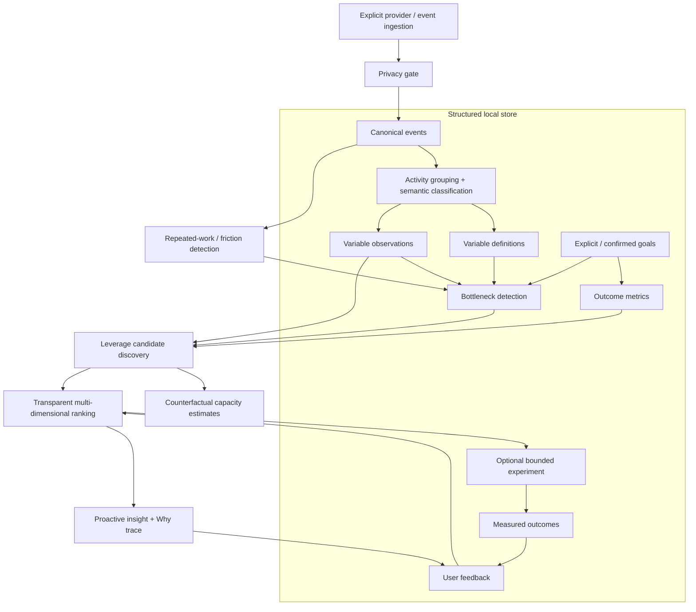

# MobileLAM / DeviceBridge — Personal Leverage Intelligence

MobileLAM is the host-local reasoning layer that turns explicitly provided behavioural telemetry into inspectable hypotheses about leverage. It is **not** a screen-time score, engagement optimizer, covert monitor, or autonomous life-decision system.

The core question is:

> Given what the user is currently doing and the goals they have actually stated, which realistically controllable variable might be worth changing, and what evidence would distinguish that hypothesis from plausible alternatives?

The first implementation is deliberately narrow. It proves an end-to-end vertical slice without adding any new privileged phone capability.

## Current boundary

DeviceBridge and MobileLAM remain separate security domains:

- DeviceBridge's existing restricted phone-control path remains `MCP -> host gateway -> pinned SSH -> owner-administered helper -> restricted local UI socket`.
- MobileLAM runs in the host Node process. Its leverage tools do not call the SSH transport.
- MobileLAM observes **nothing automatically** in this MVP. Events arrive only through explicit ingestion or a provider that the caller invokes.
- The privileged device helper's mutation journal is not used as personal behavioural memory.
- Recommendations are emitted as `recommendation_only` with `action_authority: user_required`.
- There is no automatic execution of consequential recommendations.

Existing Gate-B physical acceptance remains separate from leverage-engine tests.

## Architecture



The implementation lives under `src/leverage/`:

- `model.mjs` — canonical events, goals, privacy, outcome and feedback schemas.
- `privacy.mjs` — pause/exclusion/consent/retention decisions.
- `storage.mjs` — local structured JSON state with `0700` directory / `0600` file permissions and atomic replacement.
- `providers.mjs` — provider contract and test/static provider.
- `pipeline.mjs` — activities, variables, repetition, counterfactuals, initial career/repetition leverage rules, ranking and graph construction.
- `reasoning.mjs` — outcome metrics, bottlenecks, opportunity costs and proactive insight projection.
- `domains.mjs` — plug-in contract for additional life-domain discovery modules.
- `service.mjs` — persistence/orchestration/API semantics.
- `index.mjs` — programmatic API.

## Canonical event model

A provider emits events shaped approximately like:

```json
{
  "timestamp": "2026-09-20T10:00:00.000Z",
  "device_id": "laptop-1",
  "source": "development-provider",
  "application": "VS Code",
  "action_type": "code_edit",
  "object": "project-a",
  "context": {},
  "duration_ms": 3600000,
  "confidence": 0.95,
  "privacy_class": "PERSONAL",
  "raw_event_ref": "optional-provider-reference"
}
```

The canonical event is an **observation record**. It is not an assertion about intent or value.

`context` is bounded to 16 KiB. Ingestion is bounded to 500 events per call. Duplicate event IDs are rejected.

## Observation → activity

`buildActivities()` groups temporally adjacent events only after assigning a semantic category. Provider-supplied activity hints can extend the taxonomy; deterministic fallback rules cover the first MVP categories such as development, job discovery/applications, learning, meetings, administration and health activity.

An activity contains its evidence event IDs, confidence and classification basis. An inferred intent remains an inference.

The taxonomy is not treated as final. Providers may supply an activity category/subcategory and additional domain modules can consume the same structured activity stream.

## Variables are separate from observations

The engine intentionally separates:

- **Variable definition** — what is being measured, its unit, controllability, observability, confidence and source dependencies.
- **Observation** — a value for that variable at a time, with evidence and confidence.

The MVP derives, among other things:

- time by activity category/subcategory;
- action counts;
- application context switches;
- repeated-workflow executions;
- repeated-workflow hours/week.

A variable can later be supplied directly, derived, inferred or retrieved externally without changing the basic representation.

## Goals and outcome metrics

Goals have provenance. An inferred goal cannot be marked confirmed by the schema; it must remain `unconfirmed` until the user explicitly confirms it.

A goal may contain explicit `outcome_metrics`, each with:

- `id`
- `name`
- `domain`
- `unit`
- `direction`: `increase`, `decrease`, `maintain` or `unspecified`
- `weight`

For backwards-compatible `objective_variables`, MobileLAM derives outcome-metric placeholders with **unspecified direction and unit** rather than pretending the intended optimization direction is known.

Multiple outcome dimensions remain available simultaneously. The engine does not collapse a life goal into one universal utility number.

## Repetition and friction

The MVP detects a repeated workflow when either:

1. a provider emits a stable `context.workflow_signature`; or
2. the action type is one of the intentionally narrow repeatable-action classes.

It requires at least three executions before producing a repeated-work record. The record includes observed executions, total time, average duration, weekly-normalized time, annualized time, confidence and source evidence.

The annualized figure is an extrapolation of the observed rate, not a claim that the future will definitely look the same.

## Bottlenecks

Bottlenecks are separate records, not labels attached without explanation.

Examples in the MVP:

- repeated manual work consuming a measurable resource;
- the job-discovery → application pipeline stage when browsing time is substantial relative to recorded submissions.

A bottleneck record contains:

- status such as `observed_constraint`, `suspected_constraint` or `monitored_stage`;
- constrained variables;
- competing hypotheses;
- confidence;
- evidence;
- missing variables.

For the career fixture, MobileLAM explicitly preserves competing explanations:

- filtering/application friction may suppress throughput;
- deliberate selectivity may explain low volume;
- application quality/targeting may be the downstream constraint.

Without interview conversion data it does not decide between them.

## Value of information

A missing variable can itself become the highest-value next step.

The synthetic career example knows application count but does not know application → interview conversion. MobileLAM therefore emits `career.application_to_interview_conversion` as missing information because it separates two materially different bottleneck hypotheses: insufficient qualified volume versus insufficient conversion quality.

## Leverage candidates and counterfactuals

A leverage candidate contains:

- controllable variable/current value/proposed value;
- expected effect statement;
- effort, financial cost and risk;
- time to impact;
- reversibility;
- confidence;
- strategic value;
- compounding potential;
- evidence;
- assumptions;
- alternatives;
- missing variables;
- traceability.

Counterfactual arithmetic is deterministic where possible. For example, 4 observed hours/week of repeated manual work with an assumption that 75% is avoidable produces a 156-hour 52-week **capacity estimate**. The result explicitly says that reclaimed time is not automatically assumed to create a better outcome.

## Ranking

The MVP exposes the ranking dimensions and a transparent ordering heuristic. It combines:

- expected upside;
- effort;
- financial cost;
- confidence;
- reversibility;
- risk;
- time to impact;
- strategic value;
- compounding potential.

`heuristic_score` is for ordering candidates. The API explicitly states that it is **not an estimate of truth or guaranteed value**.

Opportunity-cost alternatives are returned as **not ranked**. For example, reclaimed time may be used for project work, learning, applications/networking or rest/personal time; MobileLAM does not silently declare which is best.

## Why trace

`leverage_why` / `service.why()` returns an inspectable chain:

```text
observation
  ↓
inference
  ↓
hypothesis + assumptions + alternatives
  ↓
recommendation
```

It also returns relevant bottlenecks, missing variables, opportunity cost, ranking dimensions and any recorded measured outcomes.

The engine keeps `observation`, `inference`, `hypothesis`, `recommendation`, user-authorized action state and `measured outcome` semantically distinct.

## Feedback versus measured outcomes

These are deliberately separate stores and APIs.

**Feedback** records whether a recommendation was accepted, dismissed, completed, partially completed, and optionally a user rating/reason.

**Measured outcomes** record a metric/value/unit/confidence/evidence against an opportunity or experiment.

A user can like a recommendation that produces no measurable improvement, or dislike a recommendation that nevertheless changed a metric. The data model does not treat those as equivalent.

An exact dismissed opportunity/evidence signature is suppressed on the next ranking pass. If underlying evidence changes materially, the candidate may reappear.

## Experiments

Where causality is uncertain, `leverage_experiment` creates a bounded experiment instead of promoting a hypothesis to a causal fact. It records:

- hypothesis;
- intervention;
- baseline period;
- experiment period;
- metrics;
- assumptions;
- confidence;
- `action_authority: user_required`.

The MVP creates experiment plans; it does not execute them automatically.

## Personal leverage graph

`leverage_find` returns a visualisable `leverage_map` with nodes for goals, variables, bottlenecks, opportunities and resources. Edges carry relationship type, claim type, confidence, evidence and update time.

Current edge claim types include `hypothesis` and `counterfactual_estimate`. A correlation or heuristic association is never silently relabelled `CAUSES`.

## Privacy model

Privacy classes:

- `PUBLIC`
- `PERSONAL`
- `PRIVATE`
- `SENSITIVE`
- `RESTRICTED`

Defaults permit `PUBLIC`, `PERSONAL` and `PRIVATE`. `SENSITIVE` and `RESTRICTED` require explicit consent flags before they can be placed in the allowlist.

The policy supports:

- observation ON/OFF;
- application exclusions;
- domain/subdomain exclusions;
- source/provider exclusions;
- excluded time periods;
- raw event retention period;
- sensitive/restricted consent.

Privacy decisions occur **before accepted events are persisted**. Excluded events are returned only as rejected IDs/reasons by ingestion and are not written into behavioural history.

The local store defaults to:

```text
~/.local/share/device-bridge/leverage-store.json
```

Set `DEVICE_BRIDGE_LEVERAGE_STORE` or `--store` to use another path.

This MVP uses local filesystem permissions and local-first processing. It does not claim disk encryption; use an encrypted host filesystem where that threat matters.

## Structured memory

The store has separate collections for:

- events;
- activities;
- repetitions;
- variable definitions;
- observations;
- goals;
- outcome metrics;
- bottlenecks;
- opportunities/recommendations;
- causal/leverage graph;
- experiments;
- measured outcomes;
- user feedback.

It is not a vector-database dump. Semantic retrieval can be added later alongside—not instead of—these structured records.

## MCP API

The existing stdio MCP server now exposes host-local leverage tools in addition to DeviceBridge tools:

- `leverage_event_ingest`
- `leverage_goal_create`
- `leverage_goals`
- `leverage_find`
- `leverage_opportunities`
- `leverage_why`
- `leverage_feedback`
- `leverage_outcome_record`
- `leverage_experiment`
- `leverage_review`
- `leverage_privacy_status`
- `leverage_privacy_update`
- `leverage_history_delete`

The existing project has no HTTP server, so the MVP follows the repository's current API convention instead of adding a new unauthenticated web surface. Programmatic Node callers can use `findLeverage()` or `LeverageService` from `src/leverage/index.mjs`.

Leverage MCP tests inject a transport that throws if called and assert that leverage tools make zero SSH/device calls.

## CLI

Run the reproducible, non-persistent demonstration:

```sh
npm run leverage:demo
# or
node src/cli.mjs leverage demo
```

The demo models the requested first scenario:

- 5.3 hours job discovery;
- 2 submitted applications;
- 12 hours software development;
- 4 hours repeated administrative/manual CV-entry work;
- explicit goal: increase earning power;
- missing application → interview conversion.

The fixture contains seven observed calendar days; its snapshot timestamp is the following day, so the demo uses an 8-day rolling query to include that complete observation period.

Persistent local commands include:

```sh
node src/cli.mjs leverage ingest --file events.json
node src/cli.mjs leverage goal --description "Increase earning power" --domain career --objectives income,qualified_applications --priority 0.9
node src/cli.mjs leverage find --domain career --horizon 30d
node src/cli.mjs leverage review
node src/cli.mjs leverage privacy
node src/cli.mjs leverage feedback --opportunity UUID --status dismissed --reason "Not relevant now"
node src/cli.mjs leverage experiment --opportunity UUID --days 14
node src/cli.mjs leverage outcome --opportunity UUID --metric qualified_applications_per_week --value 6 --unit count/week
```

Deleting behavioural history requires the literal confirmation:

```sh
node src/cli.mjs leverage delete-history --confirm DELETE_LEVERAGE_HISTORY
```

Add `--retain-goals true` only when that is actually desired.

## Adding an event provider

A provider needs a stable `id` and `collect(context)` that returns canonicalizable events:

```js
const provider = {
  id: 'example-provider',
  async collect() {
    return [/* events */];
  },
};
```

Use `collectProvider()` to validate/canonicalize the result before passing it to `LeverageService.ingest()`.

Providers should expose the minimum data needed for their purpose, assign a truthful privacy class and confidence, and avoid putting raw content into `context` when metadata is sufficient.

No provider gets DeviceBridge control credentials merely because it can emit events.

## Adding a life-domain module

A domain module has a stable `id` and asynchronous `discover(context)` function. The context is a structured snapshot of already permitted data and includes a constrained `makeCandidate()` factory.

```js
const module = {
  id: 'learning',
  async discover(context) {
    const study = context.observations.find(o => o.variable_id === 'time.learning.study_hours');
    if (!study) return [];
    return [context.makeCandidate({
      key: 'learning-experiment',
      domain: 'learning',
      title: 'Test a different study allocation',
      intervention_type: 'EXPERIMENT',
      goal_ids: [],
      variable: study.variable_id,
      current_value: study.value,
      proposed_value: 'experiment',
      expected_effect: 'Unknown until measured.',
      evidence: study.evidence,
      observation: `${study.value} study hours were observed.`,
      hypothesis: 'A different allocation may improve the selected learning metric.',
      recommendation: 'Run a bounded experiment.',
      missing_variables: ['learning.selected_outcome_metric']
    })];
  }
};
```

Pass modules through `new LeverageService(store, { domainModules: [module] })` or programmatic `findLeverage(..., { domainModules: [module] })`.

The module's candidates still pass through the shared confidence adjustment, feedback suppression, ranking, human-authority marker, bottleneck/opportunity-cost enrichment and traceability pipeline.

## LLM role

No LLM is required for the MVP pipeline.

Future LLM assistance is appropriate for semantic classification, intent hypotheses, variable discovery, workflow recognition and explanation, but deterministic code should remain responsible for permissions, storage, aggregation, arithmetic, ranking inputs, audit records and API validation.

Any LLM-derived fact must be marked as inference/hypothesis with evidence and confidence; it must not overwrite an observed fact silently.

## Current limitations

The MVP does **not** yet provide automatic providers for messages, finance, health, browser history, calendar, Git, terminal, location or sensors. It provides the provider contract and explicit ingestion path.

It also does not yet provide:

- causal identification from observational data;
- generalized nonlinear/threshold discovery across arbitrary variables;
- multi-user/family models;
- encrypted application-level storage;
- background collection daemon;
- autonomous recommendation execution;
- web dashboard/operator UI;
- automatic LLM semantic classification;
- mature domain modules beyond the built-in MVP career/repetition heuristics and the plug-in contract.

Those are future milestones, not implied capabilities.

## Design invariant

The leverage engine exists to increase user agency. It must optimize against user-defined outcomes and evidence quality, not engagement with MobileLAM itself.
